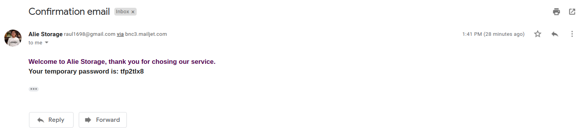
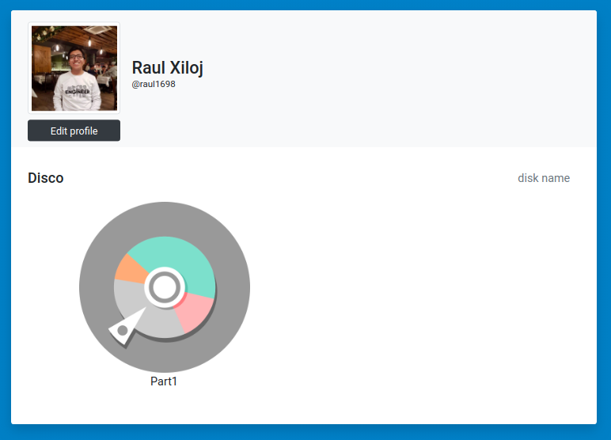

<br />
<p align="center">
  
  <h2 align="center">ALIE STORAGE</h2>
  <p align="justify">
  Alie Storage es una aplicacion que permite el almacenamiento de informacion, carpetas y archivos de un usuario en la 'nube'. 
  Cuenta con plataforma web y aplicacion movil para poder acceder a toda su informacion de manera remota. Funciona de manera 
  similar a un sistema de archivos ya que cuenta con las operaciones basicas de crear carpetas y archivos, renombrar, eliminar, 
  mover, copiar, editar el contenido de un archivo, descargar un archivo, entre otras. 
  La aplicacion fue desarrollada con angular para el frontend y nodejs y oracle db para el backend. Todos los detalles se encuentran
  en el archivo '[MIA]Proyecto2.pdf'
  <br />
  <br />
  </p>
</p>


## Instalacion
 
1. Clonar el repositorio
```sh
git clone https://github.com/raulxiloj/Alie-Storage
```
2. Instalar los paquetes npm en la carpeta server 
```sh
npm install
```

<!-- USAGE EXAMPLES -->
## Como funciona

>La comunicacion de servidor-cliente se realiza a traves de web service con nodejs (Toda la parte del servidor se encuentra en 
la carpeta server.)

- Para poder iniciar sesion se necesita registrar primero

- Luego de registarse usted recibira un correo con una contrasena temporal la cual tendra que ingresar para poder activar su cuenta,
de lo contrario no podra ingresar al sistema


- La pagina de inicio del usuario es la siguiente en la cual se muestran las particiones que el usuario tiene. Puede crear mas particiones
siguiendo la teoria de particiones

- Cuando usted presione sobre la particion 1 'Part1' (que viene por defecto) lo llevara al correspondiente sistema de archivos, que al inicio
se encuentra vacio solo tiene la carpeta raiz

- Crearemos unas cuantas carpetas y archivos para mostrar el funcionamiento 


## Desarrollado con
* Frontend
  - [Angular](https://angular.io/)
  - [Angular material](https://material.angular.io/)
  - [Bootstrap](https://getbootstrap.com)
* Backend
  - [Nodejs](https://nodejs.org/es/)
  - [TypeScript](https://www.typescriptlang.org/)
  - [Oracle db](https://www.oracle.com/database/)
* Aplicacion Local
  - C++/C

## Autor
Raul Xiloj
